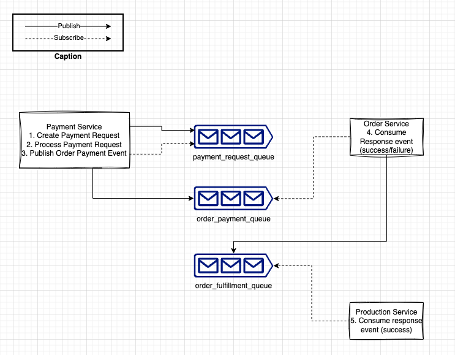
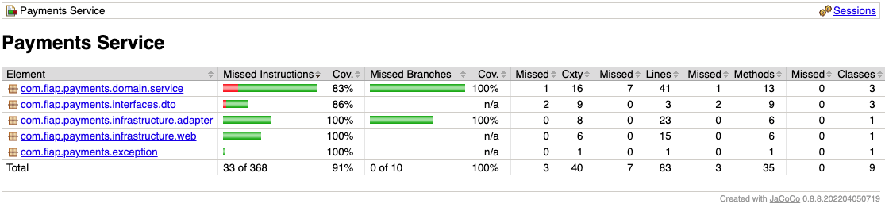

# Tech Challenge Phase 5
Pos Tech FIAP - Payments Project

## Team Members
- Gabriel Martins de Miranda - rm352234
- Thiago Merino Rodrigues Barbosa - rm351475
- Guilherme Mazzei Graf - rm351411
- Erich Nelson Silveira Pinton - rm351414

## Documentation

### Saga Pattern

Justificativa: Escolhemos o padrão de SAGA Coreografada. Levando em consideração o problema a ser resolvido e a complexidade da nossa arquitetura, a coreografia pareceu a opção que se encaixa melhor. No nosso caso são apenas 3 microservices e 3 filas. Achamos que o padrão de orquestrada se encaixaria melhor em um cenário mais complexo.
Ao tornarmos o processo de pagamento (com o provider) assíncrono, damos uma sensação de maior agilidade para o cliente pois a API não fica travada esperando a aprovação do pagamento.
Como estamos usando microservices escaláveis, múltiplas instâncias do Payment Service podem consumir eventos de pagamento, isso ajuda nos horários de pico ou lentidão do provider/vendor de pagamentos.
O Order Service fica com a responsabilidade de encaminhar o pedido para produção caso o pagamento esteja aprovado, ou avisar o cliente em caso de não ser aprovado.
Por fim o Production Service consome os eventos de pedidos para enviar para produção.

### Test Coverage Report

### DDD
- https://miro.com/app/board/uXjVNf1J6J8=

### Postman Collection
- [Postech.Payments.postman_collection.json](docs/PosTech.Payments.postman_collection.json) inside `docs` directory

### Swagger (openAPI)
- Access [Swagger](http://localhost:8080/swagger-ui/index.html) UI

## Dependencies
- Open JDK 17 - Recommended: [Amazon Corretto](https://docs.aws.amazon.com/corretto/latest/corretto-17-ug/downloads-list.html)
- [Docker](https://docs.docker.com/get-docker/)

## Running in k8s
- Check [makefile](./makefile) for commands

## Running in docker
- To start: `docker-compose up -d`
- To stop: `docker compose down`
- Database is maintained in volume

## Running locally
- Build the project: `mvn clean install -DskipTests`
- Run it in your IDE

## Verify coverage
- Build the project: `mvn verify`
